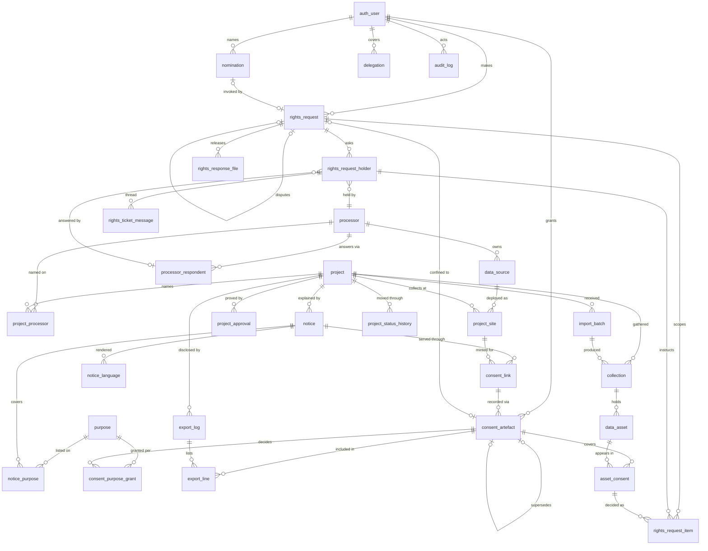

# Domain model

Thirty-one tables, one view, thirty-nine enumerations, twenty-six triggers.
The column-level reference is
[schema.md](../../cmp_backend/docs/database/schema.md), and the migrations
that built it are listed in
[migrations.md](../../cmp_backend/docs/database/migrations.md). This page is
the shape: which tables exist, how they hang together, and which rules the
database itself refuses to let anyone break.

## The shape

## Table groups

| Group | Tables | Notes |
|---|---|---|
| Identity | `auth_user`, `person_type_history`, `delegation` | One table for every account, staff and data principal, distinguished by `role`. Email nullable; a CHECK requires it for staff and a trigger requires a mobile for a data principal. Person type (external, employee, ex-employee, vendor) is tracked with its history. |
| Registry | `purpose`, `processor`, `processor_respondent`, `data_source` | Reference data. Sources belong to a processor and an owner; respondents are retired by date, never deleted. |
| Projects | `project`, `project_processor`, `project_approval`, `project_site`, `project_status_history` | A project names processors (each decided by the DPO), proves its approval, and collects at sites. A site is a source deployed for a project with an optional owner override. Status changes are history rows. |
| Notices | `notice`, `notice_language`, `notice_purpose` | A notice per project version; a rendition per language, each approved; the purposes it covers, with per-notice Rule 3 overrides. |
| Consent | `consent_link`, `consent_artefact`, `consent_purpose_grant` | Links store only a fingerprint. An artefact is one decision on one notice, one grant per purpose, superseded by withdrawal. |
| Exchange | `export_log`, `export_line`, `import_batch`, `collection`, `data_asset`, `asset_consent` | A disclosure record per export and per person, with the generated file kept in storage (`file_ref`); an import batch produces a collection of assets; a junction says which consent covers whom in which asset, with a disposition. |
| Rights | `rights_request`, `rights_request_holder`, `rights_request_item`, `rights_ticket_message`, `rights_response_file`, `nomination` | A request with its clock; one holder per party asked, with a message thread; one scope item per appearance; files released with the response; the nominee arrangement. |
| Platform | `audit_log` | Append-only, hash-chained. Sessions, one-time codes, rate counters and lockouts live in Redis, not here. |

The view `v_current_consent` resolves each (person, notice) pair to the
artefact currently in force by following the supersession chain, and derives
its status. No table stores a consent status.

## Enumerations that shape the workflows

| Enum | Values |
|---|---|
| `project_status` | `in_draft`, `pending_approval`, `approved`, `closed`; `under_process` is historical |
| `purpose_status` | `draft`, `pending_approval`, `active`, `retired` |
| `notice_status` | `draft`, `approved`, `published`, `superseded` |
| `link_status` | `active`, `expired`, `revoked` |
| consent status (derived) | `consented`, `partial`, `declined`, `withdrawn` |
| `batch_status` | `received`, `validating`, `accepted`, `partial`, `rejected` |
| `disposition` | `active`, `redacted`, `erased`, `quarantined` |
| `rights_request_type` | `access`, `correction`, `erasure`, `grievance` |
| `rights_request_status` | `received`, `in_progress`, `awaiting_holders`, `collating`, `closed` |
| `rights_request_outcome` | `complete`, `partial`, `no_records`, `refused`, `not_verified`, `reclassified_withdrawal`, `upheld`, `not_upheld` |
| `rights_request_channel` | `portal`, `public_form`, `staff_logged`, `nominee` |
| `rights_ticket_status` | `pending`, `issued`, `escalated`, `returned`, `unreturned`, `withdrawn` |
| `rights_item_state` / `rights_scope_decision` | `proposed`, `decided`, `instructed`, `applied` / `erase`, `redact`, `retain`, `quarantine` |
| `nomination_status` / `rights_trigger_event` | `pending`, `active`, `declined`, `revoked` / `death`, `incapacity` |
| `user_status` | `pending`, `active`, `suspended`, `deactivated` |

Every enumeration is a Postgres type and a Python `StrEnum` of the same
values; `tests/integration/database/test_enum_parity.py` fails when they drift.

## Rules the database holds

The application is not trusted to remember these. They are triggers,
constraints and grants, and `tests/integration/enforcement/` exercises them
with raw SQL that bypasses the service layer.

| Rule | Mechanism |
|---|---|
| Consent evidence is append-only | statement trigger refusing `UPDATE`/`DELETE` on `consent_artefact` and `consent_purpose_grant`; the application role's grant is revoked |
| The artefact carries the hash of the text served, and served precedes action | `cmp_consent_coherent()`, `CHECK served_before_action` |
| A published notice never changes | `cmp_notice_freeze()` |
| A link belongs to an approved project's site and one notice version | `cmp_link_coherent()` |
| An artefact is superseded at most once | partial unique index on `supersedes_consent_id` |
| One root artefact per (person, notice) | partial unique index `uq_artefact_one_root_per_notice` (0023); the service also locks per pair before reading what is current |
| Every write is audited in the same transaction, in a chain | `audit_log` triggers; `log_id` drawn inside `pg_advisory_xact_lock(hashtext('cmp_audit_chain'))` |
| A purpose itemises its categories | `CHECK cardinality(data_categories) >= 1` |
| A data principal has a mobile; a nominee has a mobile; staff have an email | `trg_subject_needs_mobile`, `trg_nominee_needs_mobile`, `CHECK staff_needs_email` |
| Minority is a fact of the date of birth | `cmp_is_minor(dob)` |
| One live nomination per person | partial unique index on `nomination` |
| A rights reference is unique and minted by the database | sequence-backed default on `rights_request.reference` |

Why the rules live here rather than in Python is
[ADR 0002](../decisions/0002-evidence-enforced-in-the-database.md); why the
chain position is drawn inside a lock is
[ADR 0005](../decisions/0005-audit-chain-position-inside-the-lock.md).

## Identity and keys

Every table has an integer surrogate key for joins and a `uuid` for the
outside world. No integer key leaves the process: not in a path, a body, a
CSV or a log line. Where the platform needs an unguessable handle it uses a
random token and stores only its SHA-256 (`consent_link`, nomination
acceptance).

## What is not in the database

| Thing | Where it is |
|---|---|
| Sessions, partial sessions | Redis db 0 |
| The record that a notice was served to a person (six hours) | Redis db 0, keys `nsrv:*` |
| One-time codes, MFA codes, their attempt counts | Redis db 0, with TTLs |
| Rate-limit buckets and lockouts | Redis db 0, keys `rate:*` |
| Celery broker and results | Redis db 1 and db 2 |
| Uploaded documents and released files | the `uploads` volume, referenced by path and hash |
