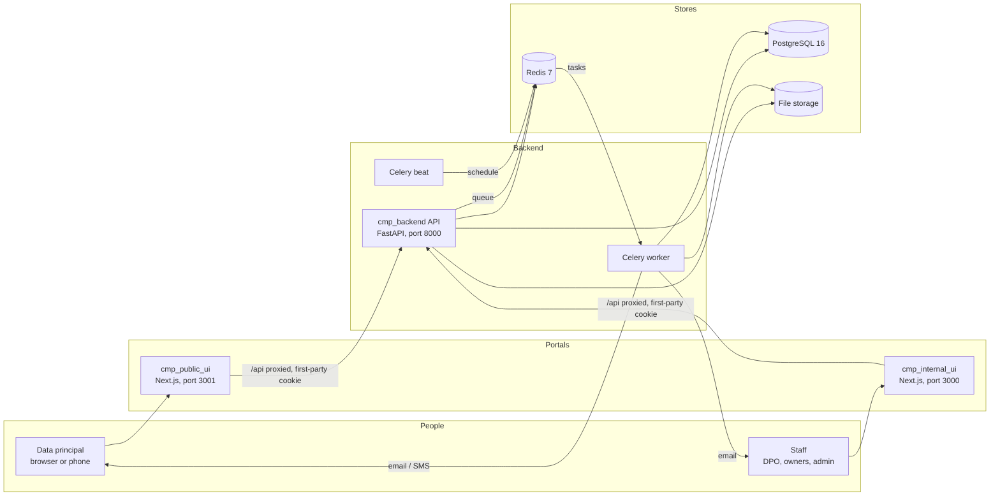

# System overview

COMPASS CMP is a consent management platform built to India's **Digital
Personal Data Protection Act 2023** and the DPDP Rules 2025. A data fiduciary
registers the projects it collects personal data for, states their purposes,
publishes notices, collects consent purpose by purpose at named sites, records
every disclosure, and answers a data principal's rights requests inside a
published period. Everything it does is arranged so that it can be proved,
years later, to somebody who was not there.

## The pieces

| Component | Directory | Runs as | Talks to |
|---|---|---|---|
| API | `cmp_backend/` | `python -m cmp` locally; gunicorn with uvicorn workers in a container | PostgreSQL, Redis, file storage |
| Worker | `cmp_backend/` | `celery worker` on six queues | PostgreSQL, Redis, the email and SMS transports |
| Beat | `cmp_backend/` | `celery beat`, exactly one instance | Redis |
| Staff console | `cmp_internal_ui/` | Next.js on port 3000 | the API, through its own `/api` proxy |
| Data-principal portal | `cmp_public_ui/` | Next.js on port 3001 | the API, through its own `/api` proxy |
| PostgreSQL | container `cmp-db-1` | 31 tables, 39 enums, 26 triggers, one view | |
| Redis | container `cmp-redis-1` | three logical databases: sessions and limits, broker, results | |

## Two audiences, two portals

Staff and data principals never share a screen. The **staff console** holds
the registers, the project and notice workflows, the collection model, the
disclosure register, the DPO's rights queue and the audit trail. The
**data-principal portal** holds the public consent flow reached from a consent
link, self-registration and one-time-code sign-in, the public rights pages, and
her own records: consents, disclosures, requests, nominations. Each portal
points the wrong kind of account at the other. The split is a deployment
boundary as much as a design one: nothing a member of staff uses ships to the
public origin.

Both portals proxy `/api/*` to the API from `next.config.ts`. The session
cookie is `HttpOnly` and `SameSite=Lax`, and a browser on one origin calling an
API on another silently drops it. The proxy keeps every call first-party, which
is why `NEXT_PUBLIC_API_URL` stays unset in local development.

## How a request travels

1. The browser calls `/api/...` on its own origin; Next.js forwards it to the API.
2. Middleware: trusted host, CORS, gzip, then the request id (first, so every
   later line can be correlated), security headers, the body limit, the access
   log with the consent token scrubbed.
3. Dependencies resolve the session from the cookie, check the CSRF header on
   unsafe verbs, resolve the principal, and consult the permission matrix.
4. The router opens one transaction and calls one domain service. The service
   applies the rules, writes, and records the audit row in the same
   transaction.
5. The repository runs hand-written SQL in which the caller's scope is part of
   the `WHERE` clause, so a row outside scope is never selected.
6. PostgreSQL holds the invariants: CHECK constraints, append-only triggers,
   the notice freeze, the audit hash chain, and a revoked `UPDATE` grant on
   evidence tables.

Side effects that a person is not waiting for - a code, an acknowledgement, a
ticket, a report - are queued to Celery and delivered by the worker. Codes go
on `high_priority`, so a sign-in never waits behind an export.

The detail is in
[request-lifecycle.md](../../cmp_backend/docs/architecture/request-lifecycle.md).

## The four workflows

| Workflow | Starts with | Ends with | Document |
|---|---|---|---|
| Collection set-up | An R&D user registers a project and names its purposes and collectors | A DPO approves it; a collection owner registers sites and mints consent links | [collection-and-routing.md](../domain/collection-and-routing.md) |
| Consent | A data principal opens a consent link | A consent artefact per purpose, superseded only by a later withdrawal | [consent-lifecycle.md](../domain/consent-lifecycle.md) |
| Exchange | A collection owner exports a file or imports a manifest | A disclosure record naming every person in the file; assets reconciled to consents | [collection-and-routing.md](../domain/collection-and-routing.md#exports-imports-and-assets) |
| Rights | A data principal, a stranger on the public form, or a nominee asks | A response released inside the published period, with every holder's ticket returned or escalated | [rights-requests.md](../domain/rights-requests.md) |

## What is enforced where

| Kind of rule | Example | Held by |
|---|---|---|
| Shape | a mobile number, a uuid, a bounded string | Pydantic models, from `cmp.validation` |
| Rule | may this project move to that state; may this role do this | the domain services and the permission matrix |
| Invariant | a published notice cannot change; an audit row cannot be edited; a consent artefact carries the hash of the text served | PostgreSQL triggers and constraints |

The third layer is the one that survives a bug, a migration and a `psql`
session. See [ADR 0002](../decisions/0002-evidence-enforced-in-the-database.md).

## Environments

| Environment | Set by | Differences |
|---|---|---|
| `local` | default | Email and SMS are written to `cmp_backend/var/outbox.log`; `/docs` is served; cookies need not be `Secure` |
| `test` | the test suites | As local, with the outbox |
| `production` | `ENVIRONMENT=production` | Refuses to start on the development secret key, a default database password, insecure cookies, `DEBUG`, or a wildcard CORS origin; `/docs` and `/openapi.json` are not served |

## Ports and URLs, locally

| What | URL |
|---|---|
| API | http://127.0.0.1:8000, interactive docs at `/docs` |
| Staff console | http://localhost:3000 |
| Data-principal portal | http://localhost:3001 |
| PostgreSQL | 127.0.0.1:5432, database `cmp_dev` for this checkout |
| Redis | 127.0.0.1:6379 |

The backend's `PUBLIC_BASE_URL` must name the portal and `CONSOLE_BASE_URL`
the console: every link the platform puts in a message is built from them.
