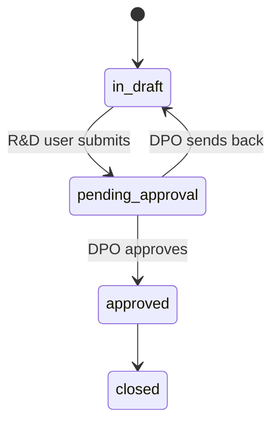

# Collection and routing

How a study becomes somewhere data is collected, who is accountable for each
piece of it, and how a file that leaves or arrives is recorded. This is the
part of the platform staff live in.

## The registry

Three reference tables, maintained mostly by the DPO and read by everyone:

- **Purposes**: each with a lawful basis, itemised data categories (Rule
  3(b)(i) - the database refuses an empty list), a retention period and basis,
  an erasure trigger and what happens when retention lapses, and whether a
  minor may consent to it (s.9). A purpose is drafted, activated, and later
  retired; a retired purpose stays on the notices that named it.
- **Processors**: the parties that collect or handle data. `is_in_house`
  distinguishes the organisation's own teams from a third party, and that one
  flag decides most of the routing below. A processor carries its
  **respondents**: for an in-house processor, accounts on the platform who
  answer a rights ticket in the console; for a third party, names and
  addresses reached by email. Respondents are retired by stamping a date,
  never deleted, so a closed ticket still points at who answered it. A third
  party may also be represented by one of the organisation's own accounts.
- **Data sources**: the rigs and systems that capture data, each belonging to
  one processor and owned by one person. The owner is who a site follows.

## A project's life

An R&D user registers the project, names the processors that will collect
("who is collecting"), and uploads its notice. Submitting for approval requires
the pieces the DPO will judge: the notice, the collectors, the proofs.

Every requirement on that move is the author's own, and nothing on it waits for
the Privacy Office. The DPO's two acts on a notice - approving its text and
activating the purposes it carries - gate their own approval instead.

Both have to be stated somewhere, because approving a project publishes its
notice in the same transaction and publication refuses a purpose nobody has
activated. Stated on the approval, the move is offered as blocked with a
sentence naming what is missing, and the controls for both are on the notice the
officer is already reading. Before that it was checked at publication alone, so
a project reached review looking complete, the officer was told the only thing
in the way was the text, approved the text, was offered the move - and the move
failed on a purpose no screen had named.

The DPO takes those decisions on the notice itself, one purpose at a time. One
at a time deliberately: what is being signed off is each purpose, and a single
control over the set would be a click rather than a review. Where they are taken
is the part that changed - the checklist names each purpose, every line links to
the card that clears it, and the activation happens there instead of in the
purposes register, which the officer used to reach by a different route and
filter by hand. The DPO decides each named processor and the
project; a refusal carries a reason and is audited. After approval the R&D
user may still ask to add a collector, which is a request the DPO decides,
not an edit.

`GET /projects/{uuid}/transitions` returns, for the caller's role, which
transitions exist, which are allowed now, and what blocks the others. The
console renders that answer as it is - a blocked transition is a disabled
button with its reason, never a hidden one. The rules live in
`backend/api/src/cmp/domain/projects/state_machine.py` and are tested over
every (from, to, role) combination.

## Where an approved project goes

The processors a project names decide who sets its collection up:

| The project names | It routes to | Who then |
|---|---|---|
| A third-party processor | the **DCO Admin** | attaches the sources the third party will use, registers a site for each, and names who runs it |
| An in-house processor | the **R&D owner** | names the sources, and an **RCO** takes ownership of the in-house collection |

Neither rule reads a processor's name; `is_in_house` is what decides. A
project naming both kinds is one project with two collection owners, each of
whom sees only their own sites.

## Sites and their owners

A **site** is a data source deployed for a project at a place. It is
registered by choosing the source from the registry, not by typing a name:
the processor, the label and the accountable person all follow from the
source, and asking for them separately invited them to disagree. A site's
owner is its source's owner unless the DCO Admin names a different person for
this site alone ("who runs it"), which is recorded as a named exception rather
than moving the source.

The first owned site hands the project to its owner; that is how a project
reaches a DCO without anyone nominating one on the project itself. A
collection owner sees the sites they run and no others: the site scope is
stricter than the project scope, so an owner who reaches a project through
one site cannot mint a link for a colleague's site on the same study.

## Consent links

A site's owner mints a **consent link** for it: a capability URL on the
data-principal portal, tied to the notice version current at minting, with an
expiry and a use budget. The database keeps the token sealed as well as
digested, so the address can be shown again to whoever has to share it; a link
minted before that was so cannot be recovered, and the console says so rather
than copying an empty string. Either way it can be **reminted**, which replaces
it with a fresh one and records why. A field agent can be assigned to a site,
which mints the agent's link. The 15-minute maintenance task expires links
past their date.

**The API returns the link as a path, and the console puts the portal in front
of it.** Which host serves `/c/{token}` is deployment configuration, so baking
one into the response would produce links that are confidently wrong after a
move. The console reads `NEXT_PUBLIC_SUBJECT_PORTAL_URL` for it - the same
origin it sends a data principal to from its own sign-in page - because the
route belongs to the portal and not to the console it was copied from.

## Exports, imports and assets

**Export.** One export per project, a CSV of the people whose current consent
covers the export's purpose, produced by a collection owner or the DPO. The
disclosure record - `export_log` and one `export_line` per person - is written
with the file, in one transaction, and is what answers "who was my data shared
with" on a data principal's page and what derives the holders of her data when
she makes a rights request.

**Import.** A manifest of collected assets from a source, validated as a dry
run first (`POST /imports/validate` writes nothing), then written as a batch
that upserts on the source's own reference so a redelivered manifest cannot
duplicate. Errors are kept per line.

**Collections and assets.** A collection is what a site gathered under a
project; an asset is one collected thing, which may hold several people. The
`asset_consent` junction says which consent covers which person in which
asset. A person in an asset with no consent is a **bystander** - the row is
kept, visibly, so the exception can be dealt with rather than hidden. The
6-hourly reconciliation flags unmapped assets and never deletes.

Each person's appearance in an asset carries a **disposition**: active, or
what a rights request decided about it - erased, redacted, retained,
quarantined. Erasure changes the junction row, never the asset, because an
asset holding three people is not deleted when one of them asks.

## Delegation

Any member of staff can delegate for a period (Delegate, in the console).
The delegate sees and acts on the delegator's rows, under their own name and
audited as themselves, until the period ends or either party ends it early.
It hands over a workload, not a role.

## Where this is enforced

| Rule | Where |
|---|---|
| Only an approved project's site may have a link | `cmp_link_coherent()` trigger |
| A link is tied to one notice version | the link row; a new notice version means a remint |
| A site's source belongs to a processor the project approved | `add_site` in the projects service |
| Categories on a purpose are itemised | `CHECK cardinality(data_categories) >= 1` |
| The disclosure record and the file agree | one transaction in the exchange service |
| A bystander is a visible row | nullable `consent_id` on `asset_consent`, with a CHECK |

Related reading: [roles-and-access.md](roles-and-access.md) for who sees what,
[consent-lifecycle.md](consent-lifecycle.md) for what happens once a link is
opened, and [rights-requests.md](rights-requests.md) for how exports and
assets become the holders of a person's data.
