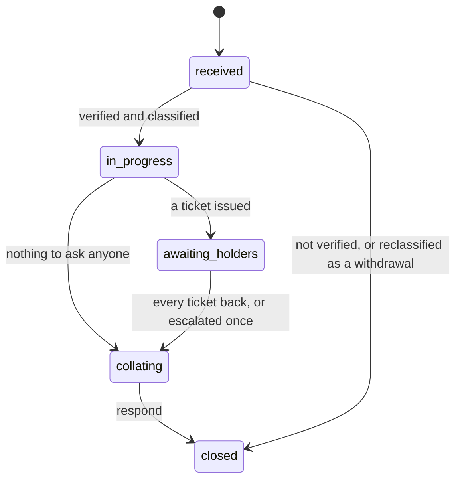

# Rights requests

How a data principal exercises the rights the Act gives her (ss.11 to 14),
and how the Privacy Office answers within a published period with a record it
can produce. The backend's own reference, including the clock arithmetic and
the enforcement inventory, is
[rights.md](../../cmp_backend/docs/architecture/rights.md); this page is the
workflow as people experience it.

## The four rights

| Type | Section | What she asks | What she gets back |
|---|---|---|---|
| `access` | s.11 | a summary of her data, the processing, and who it was shared with | the summary, and any files the office releases with it |
| `correction` | s.12 | an update, completion or correction | the correction applied, or the reason it was not |
| `erasure` | s.12 | erasure of her data | a decision per appearance of her in an asset: erased, redacted, retained or quarantined |
| `grievance` | s.13 | a complaint, usually about how another request was handled | a finding: upheld or not, with the route to the Board |

Every request has a reference like `RR-2026-000042`, minted by the database,
which is what she quotes on the phone, in the public form, and in a grievance.

## Where a request comes from

| Channel | Who | How identity is established |
|---|---|---|
| `portal` | a signed-in data principal | her session |
| `public_form` | anyone, from the rights page | a code sent to a contact on file, or the DPO's manual verification |
| `nominee` | a nominee whose nomination is in effect | the nominee's own sign-in, plus the event evidenced |
| `staff_logged` | the DPO, from an email or a letter | the DPO's verification note |

The public form is deliberately neutral: it issues a reference whether or not
the contact is known, and the code goes only to a contact on file. An
unverified request is closed by the nightly sweep after seven days, and a
stranger who asks after it is told only that it is closed.

A request can be **confined to one consent**: from her consent page she can
ask for erasure of what was collected under that consent alone, and the
holders are then derived from that consent's chain rather than her whole
record.

## The clock

The clock starts at receipt (D0), not at verification, and the due date is
stamped on the row at receipt so a later change in configuration never moves
a running request. The default period is the Rule 14 outer limit.

| Checkpoint | Default | Setting |
|---|---|---|
| Acknowledge | D0 + 2 days | `RIGHTS_ACKNOWLEDGE_WITHIN_DAYS` |
| Tickets issued | D0 + 5 days | `RIGHTS_TICKETS_WITHIN_DAYS` |
| Halfway | midway | derived |
| Collate | D - 5 days | `RIGHTS_COLLATE_BEFORE_DAYS` |
| Respond | D0 + 90 days | `RIGHTS_RESPONSE_PERIOD_DAYS`, `GRIEVANCE_RESPONSE_PERIOD_DAYS` |

The API returns the checkpoints on every request, so the console, the
acknowledgement email and the dashboard cannot disagree about a date.

## The states

Closure carries an **outcome**: `complete`, `partial`, `no_records`,
`refused`, `not_verified`, `reclassified_withdrawal`, or for a grievance
`upheld` or `not_upheld`. A response that does not give her what she asked
names the Data Protection Board as the next step.

Moving `received` to `in_progress` needs the request verified and classified;
for an erasure the intent confirmed with her; for a nominee's request the
event evidenced; for a grievance about the DPO, an independent reviewer
assigned. The transitions endpoint says what is missing, and the console
shows it beside a disabled button.

## Holders and tickets

A **holder** is a party that holds her data, derived from the disclosure
records and the assets (`export_line`, `asset_consent`) and confirmed by the
DPO, who may add one by hand. Each confirmed holder gets one **ticket**: the
instruction to return what it holds, addressed to a **respondent** of that
processor.

- An in-house processor's respondent is an account on the platform. The
  ticket reaches them on their dashboard and the console's tickets page, and
  they answer there, with files.
- A third party's respondent is a name and an address. The ticket travels by
  email, with a summary of the request, and the DPO records what came back.

A ticket is a **thread**: it opens with what the office already knows, and
either side may write on it, attaching files. Unread messages are counted on
both ends, so the office's bell rings when a respondent writes and the
respondent's when the office does.

| Ticket state | Means |
|---|---|
| `pending` | holder confirmed, ticket not yet sent |
| `issued` | sent, awaiting the holder |
| `returned` | the holder has answered |
| `unreturned` | the due date passed with no answer |
| `escalated` | reminded formally, once |
| `withdrawn` | the office no longer needs it |

A returned ticket can be **sent back** with a reason when the answer is not
enough; a ticket can be **reassigned** to another respondent, **reminded**,
or **withdrawn**. The last ticket to come back moves the request off
`awaiting_holders`.

## Erasure scope

For an erasure, the office builds the **scope**: one item per appearance of
her in an asset, each proposed and then decided by the DPO as `erase`,
`redact`, `retain` or `quarantine`, with a reason. Items are instructed to the
holder with the ticket and marked applied when confirmed. Applying an item
changes the person's disposition on the `asset_consent` row and never the
asset, because an asset holding three people is not deleted when one of them
asks. A retained item names the legal ground.

## The response

Responding closes the request with an outcome and a response text. The
response is sent to her by email and appears on her portal page, together with
any **response files** the office released, each downloadable for a bounded
period (`RIGHTS_DOWNLOAD_TTL_DAYS`, 30 by default) and hashed on the row.
She can **dispute** a closed request from the portal, which opens a grievance
linked to it, and a grievance carries the request it disputes.

## Nominees

A data principal names one nominee, by mobile with an optional email, while
she is well. The nominee receives a link and must accept it with a code sent
to the medium they choose; acceptance gives them an account and the reference
they need to act. Acceptance is due within thirty days. Nominations can be
declined, revoked, and are shown to both parties.

When the nominee invokes the nomination they name the **trigger event**,
`death` or `incapacity`, and the DPO evidences it before the request moves.
Death closes the principal's account; incapacity does not. The nomination
records which request invoked it.

## Grievances

A grievance is linked to the request it disputes, where there is one. A
grievance about the DPO's own handling is **escalated** to the administrator,
who assigns an independent reviewer; the reviewer, not the DPO, then acts on
it. The administrator's scope on the rights register is exactly those
escalations.

## What runs on its own

- The nightly **sweep** (02:30) closes unverified requests past seven days,
  marks tickets unreturned at their due date, and sends the reminders the
  checkpoints call for.
- **Notifications** go out through the Celery `notifications` queue and, in
  development, land in the outbox file.
- The **dashboard** shows the office the requests past a checkpoint, the
  tickets awaiting it, and the unread messages by request; it shows a
  respondent the tickets awaiting them.

## Where this is enforced

| Rule | Where |
|---|---|
| A request may only walk forward, with the prerequisites met | `domain/rights/state_machine.py`, tested per transition |
| Due date fixed at receipt | column on `rights_request`, stamped in the service |
| One live nomination per person | partial unique index on `nomination` |
| A nominee needs a mobile | `trg_nominee_needs_mobile` |
| A ticket is answered by the respondent it names | scope on `ticket` is `OWN` for every staff role |
| A response file is hashed and time-boxed | `rights_response_file` |
| Every action audited | the audit chain, same transaction |

Open decisions taken as defaults, and how to change them, are listed at the
end of [rights.md](../../cmp_backend/docs/architecture/rights.md) and in
[ADR 0010](../decisions/0010-rights-clock-and-defaults.md).
