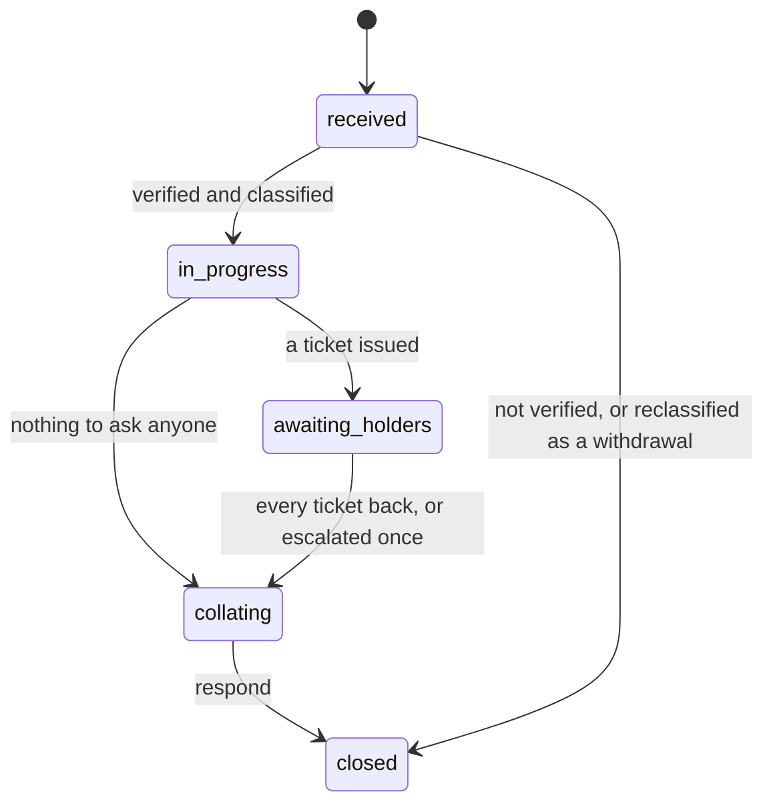

# Rights requests

How a data principal exercises the rights the Act gives her (ss.11 to 14),
and how the Privacy Office answers within a published period with a record it
can produce. The backend's own reference, including the clock arithmetic and
the enforcement inventory, is
[rights.md](../architecture/rights-module.md); this page is the
workflow as people experience it.

## The three requests

| Type | Section | What she asks | What she gets back |
|---|---|---|---|
| `access` | s.11 | a summary of her data, the processing, and who it was shared with | the summary, and any files the office releases with it |
| `erasure` | s.12 | erasure of her data | a decision per appearance of her in an asset: erased, redacted, retained or quarantined |
| `grievance` | s.13 | a complaint, usually about how another request was handled | a finding: upheld or not, with the route to the Board |

**Three, not four (DPO, 2026-10-07).** A new request is access, erasure or a
grievance, on every channel - the portal, the public form, a nominee, and one
the DPO logs - and nothing is reclassified as a correction. A correction to
her name is made from her account (S3-05). The `correction` type stays in the
database for requests made before, which are handled to the end as they were:
the classification card offers a request its own type, and a correction
counts as carried out as before. The server refuses the fourth
(`cmp.domain.rights.service.taken`), so a stale client cannot bring it back.

Every request has a reference like `RR-2026-000042`, minted by the database,
which is what she quotes on the phone, in the public form, and in a grievance.

## Where a request comes from

| Channel | Who | How identity is established |
|---|---|---|
| `portal` | a signed-in data principal | her session |
| `public_form` | anyone, from the rights page | a code sent to a contact on file, or the DPO's manual verification |
| `nominee` | a nominee whose nomination is in effect | the nominee's own sign-in, plus the event evidenced |
| `staff_logged` | the DPO, from an email or a letter | the DPO's verification note |

The public form is deliberately neutral: it issues a reference whether or not
the contact is known, and the code goes only to a contact on file. An
unverified request is closed by the nightly sweep after seven days, and a
stranger who asks after it is told only that it is closed.

**A request is about everything held on her** (DPO, 2026-10-07): every
project and every consent, never one. There is no project or consent to pick
on any form, and the API refuses a `consent_uuid` on a new request. A request
made before that and confined to one consent still shows the consent it was
confined to, and its holders stay derived from that consent's chain.

**Documents with a request** (2026-10-07). Signed in, she can send documents
with her request - a proof of who she is, a letter, a screenshot: PDF, PNG,
JPEG, text or Word, 25 MB each, at most ten, while the request is open. The
portal sends them once the request is recorded, so the clock runs from the
request; one refused does not undo it. Each is kept as it came
(`rights_request_attachment`, append-only, the name sealed) and the DPO
downloads it from the request page; every download is on the trail, which
never records a name. The public form takes none: nobody is known until the
code is confirmed.

## The clock

The clock starts at receipt (D0), not at verification, and the due date is
stamped on the row at receipt so a later change in configuration never moves
a running request. The default period is the Rule 14 outer limit.

| Checkpoint | Default | Setting |
|---|---|---|
| Acknowledge | D0 + 2 days | `RIGHTS_ACKNOWLEDGE_WITHIN_DAYS` |
| Tickets issued | D0 + 5 days | `RIGHTS_TICKETS_WITHIN_DAYS` |
| Halfway | midway | derived |
| Collate | D - 5 days | `RIGHTS_COLLATE_BEFORE_DAYS` |
| Respond | D0 + 90 days | `RIGHTS_RESPONSE_PERIOD_DAYS`, `GRIEVANCE_RESPONSE_PERIOD_DAYS` |

The API returns the checkpoints on every request, so the console, the
acknowledgement email and the dashboard cannot disagree about a date.

## The states

```mermaid
stateDiagram-v2
  [*] --> received
  received --> in_progress: verified and classified
  in_progress --> awaiting_holders: a ticket issued
  in_progress --> collating: nothing to ask anyone
  awaiting_holders --> collating: every ticket back, or escalated once
  collating --> closed: respond
  received --> closed: not verified, or reclassified as a withdrawal
```

Closure carries an **outcome**: `complete`, `partial`, `no_records`,
`refused`, `not_verified`, `reclassified_withdrawal`, or for a grievance
`upheld` or `not_upheld`. A response that does not give her what she asked
names the Data Protection Board as the next step.

Moving `received` to `in_progress` needs the request verified and classified;
for an erasure the intent confirmed with her; for a nominee's request the
event evidenced; for a grievance about the DPO, an independent reviewer
assigned. The transitions endpoint says what is missing, and the console
shows it beside a disabled button.

## Holders and tickets

A **holder** is a party that holds her data, derived from the disclosure
records and the assets (`export_line`, `asset_consent`) and confirmed by the
DPO, who may add one by hand. Each confirmed holder gets one **ticket**: the
instruction to return what it holds, addressed to a **respondent** of that
processor.

- An in-house processor's respondent is an account on the platform. The
  ticket reaches them on their dashboard and the console's tickets page, and
  they answer there, with files.
- A third party's respondent is a name and an address. The ticket travels by
  email, with a summary of the request, and the DPO records what came back.

A ticket is a **thread**: it opens with what the office already knows, and
either side may write on it, attaching files. Unread messages are counted on
both ends, so the office's bell rings when a respondent writes and the
respondent's when the office does.

| Ticket state | Means |
|---|---|
| `pending` | holder confirmed, ticket not yet sent |
| `issued` | sent, awaiting the holder |
| `returned` | the holder has answered |
| `unreturned` | the due date passed with no answer |
| `escalated` | reminded formally, once |
| `withdrawn` | the office no longer needs it |

**A return says what was done.** Whoever records it - the office for a third
party, the team itself on the console - says whether the holder did **all of
it**, **only part of it**, or **could not do it** (`return_outcome`: `done`,
`partial`, `failed`), with nothing chosen in advance. Only *done* counts as done:
an erasure's holder copy is recorded erased, and a correction counts as carried
out, only on a return that says so. Until 1 October 2026 any return counted,
so a ticket returned "unable to erase" closed the request complete
([review DPDP-1](../reviews/2026-10-01-frontend-architecture-review.md)). A
return recorded before then has no outcome and is read as done, as it was then.

A returned ticket can be **sent back** with a reason when the answer is not
enough - sending it back clears what the holder said, and is how a holder who
fell short is asked again; a ticket can be **reassigned** to another respondent, **reminded**,
or **withdrawn**. The last ticket to come back moves the request off
`awaiting_holders`.

**Breach tickets follow this model** ([breaches.md](breaches.md#breach-tickets),
ADR 0023): an instruction, a thread with files, a return saying done, partial or
failed, the office sending back or closing. They differ in four ways: they go to
internal staff only, by email domain; one person holds one ticket per breach;
their state is folded from append-only events rather than a status column; and
only the DPO closes one. They appear on the same **Tickets** page.

## Erasure scope

For an erasure, the office builds the **scope**: one item per appearance of
her in an asset, each proposed and then decided by the DPO as `erase`,
`redact`, `retain` or `quarantine`, with a reason. A retained item names the
legal ground. An asset holding other people is never erased (decision D-09): it
is redacted, or quarantined if removal cannot be assured.

**Applying quarantines; the executor erases** (S2-03). Applying an item
quarantines her appearance at once - out of any use or release, and
recoverable if the decision was a mistake. For a quarantine that is the whole of
it. An erase, a redaction, or a retention whose floor has passed then goes to
the **executor**, which reaches each store that holds the item. The platform
never holds an asset's bytes - a recording lives at the source that collected
it - so the stores are:

| Store | Done when |
|---|---|
| The holder's copy | the holder of the asset's source returns its ticket saying it did all of it - the return, with its evidence, is the confirmation the copy is gone. Until then it is *waiting*, and says for what: no holder asked yet, the ticket not issued, withdrawn, or not returned. A return saying it did only part, or none, is *failed* with the holder's word (`holder_reported_partial`, `holder_reported_failed`); send the ticket back to ask again |
| The platform's pointer | for an erasure (nobody else in the asset), `data_asset.storage_ref` is cleared. A redaction keeps it for the others |

Every attempt at every store is a row, append-only: done, waiting, failed or
held, and why. When every store is done the item is **executed** - it gets
`executed_at`, and only then does her disposition read erased or redacted.
Anything waiting or failed is tried again by the daily sweep, on each holder's
return, and on demand by the DPO ("Try again now"), and stays on the request,
visible, until it succeeds. An item counts as **done** for the response (S2-02)
only when it is executed, or when it was a quarantine.

**What an erasure never touches.** Consent artefacts and the audit trail - they
prove the processing was lawful at the time. The export files a processor was
sent and the response packages she was given are records of what happened, and
are not rewritten either (decided with the product owner, 2026-09-24); the
response says so. Her `asset_consent` row stays as the record of what was done
to her appearance.

**A legal hold stops it.** The DPO may place a hold on an asset or on a person,
with a reason (sealed). Every item it covers records `held` and goes no
further, including an item whose erasure was applied before the hold was
placed; releasing the hold lets the executor carry on at once, and closes each
`held` row as done with the hold it waited for, so the item can complete. A
hold is placed once and released once - nothing else about it can change.

**Backups are not covered yet.** There are no database backups today (parked,
P-03), and whether a backup holding an erased item is scrubbed or left to
expire is a decision for Legal. Until it is made, an erasure says nothing about
backups.

## The response

Responding closes the request with an outcome and a response text.

**`complete` has to be earned** (S2-02). A correction or an erasure closes as
complete only when what it asked for was carried out: every holder returned its
ticket saying it did all of it, every erasure item is done, and something was actually done - a request
with no item in scope and no holder's return is one nobody carried out, and
`no_records` is the honest answer when nothing is held. Anything short of that
closes `partial`, and the record she receives says, item by item, what happened
to each appearance of her - "quarantined: kept out of any use or release, not
erased", "decided for erasure, not yet carried out" - and lists what is not yet
done, in the file and in the mail. Nothing in it says "erased" for what was
not. The rule is `cmp.domain.rights.execution`; the request detail serves its
answer as `complete_blocked_by`, which is how the console knows to hold
Complete back and say why. Access and grievance are untouched: they ask for a
copy and a decision, not a change.

The response is sent to her by email and appears on her portal page, together with
any **response files** the office released, each downloadable for a bounded
period (`RIGHTS_DOWNLOAD_TTL_DAYS`, 30 by default) and hashed on the row.
She can **dispute** a closed request from the portal, which opens a grievance
linked to it, and a grievance carries the request it disputes.

## Nominees

A data principal names one nominee, by mobile with an optional email, while
she is well. The nominee receives a link and must accept it with a code sent
to the medium they choose; acceptance gives them an account and the reference
they need to act. Acceptance is due within thirty days. Nominations can be
declined, revoked, and are shown to both parties.

When the nominee invokes the nomination they name the **trigger event**,
`death` or `incapacity`, and the DPO evidences it before the request moves.
Death closes the principal's account; incapacity does not. The nomination
records which request invoked it.

**The nominee follows that request to the end.** Signed in, it reads to them
as it does to her: the state, the clock, the path, the response and the files
released with it. They are the person exercising the right, and every message
about the request already goes to them rather than to her, who may be exactly
as incapacitated as claimed. On an incapacity claim she is acknowledged as
well, because her account stays open and the request appears in her own list.

Reading is not acting. Being signed in is enough to see what became of the
request they raised; making another in her name still needs the nominee page
and a code to a contact she recorded, and so does disputing a response, which
makes a new request. A nomination revoked after it was invoked keeps its
request in the nominee's view, marked as no longer in effect: revocation stops
what comes next and does not unask the question they lawfully asked
([ADR 0014](../decisions/0014-a-nominee-follows-the-request-they-raised.md)).

## Grievances

A grievance is linked to the request it disputes, where there is one. A
grievance about the DPO's own handling is **escalated** to the administrator,
who assigns an independent reviewer; the reviewer, not the DPO, then acts on
it. The administrator's scope on the rights register is exactly those
escalations.

## What runs on its own

- The nightly **sweep** (02:30) closes unverified requests past seven days,
  marks tickets unreturned at their due date, and sends the reminders the
  checkpoints call for.
- **Notifications** go out through the Celery `notifications` queue and, in
  development, land in the outbox file.
- The **dashboard** shows the office the requests past a checkpoint, the
  tickets awaiting it, and the unread messages by request; it shows a
  respondent the tickets awaiting them.

## Finding a request

The console's requests list filters by status, kind, overdue and unread; it
has no search box. The API's `GET /requests?q=` takes a reference or part
of one, the contact on the request or on the matched account typed
**whole**, or three letters or more of the name on the form or on the
account. The contact and the name are sealed, so they are matched through
keyed hashes and never compared as text
([the DKMS field list](../dkms/pii-tables-and-fields.md#2-the-eight-lookup-columns-and-their-hash-columns)).
In the console today a request is found by name through the audit trail's
**About** picker, which runs the same match.

## Where this is enforced

| Rule | Where |
|---|---|
| A request may only walk forward, with the prerequisites met | `domain/rights/state_machine.py`, tested per transition |
| Due date fixed at receipt | column on `rights_request`, stamped in the service |
| One live nomination per person | partial unique index on `nomination` |
| A nominee needs a mobile | `trg_nominee_needs_mobile` |
| A nominee reaches the request they raised, and no other | `request_as_nominee`, joined through `nomination.nominee_user_id` |
| A ticket is answered by the respondent it names | scope on `ticket` is `OWN` for every staff role |
| A response file is hashed and time-boxed | `rights_response_file` |
| Every action audited | the audit chain, same transaction |

Open decisions taken as defaults, and how to change them, are listed at the
end of [rights.md](../architecture/rights-module.md) and in
[ADR 0010](../decisions/0010-rights-clock-and-defaults.md).
