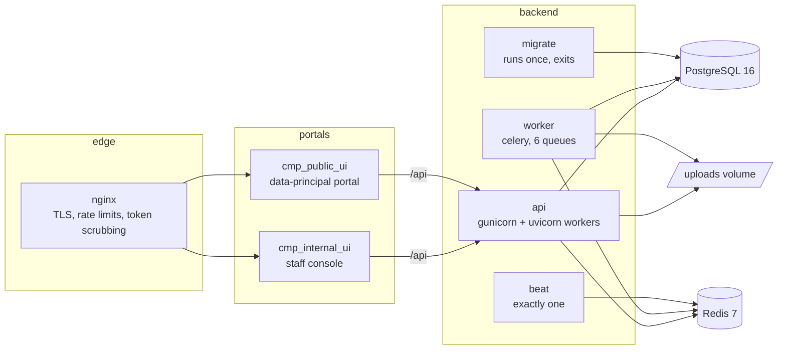

# Deployment

The platform is five processes and two datastores. This page is the topology
and the order of operations; the backend's own notes on fail-fast startup and
what production refuses are in
[cmp_backend/docs/operations/deployment.md](../../cmp_backend/docs/operations/deployment.md)
and [configuration.md](../../cmp_backend/docs/operations/configuration.md).

## Topology

| Process | Image | Scales | Notes |
|---|---|---|---|
| `api` | `cmp_backend/docker/Dockerfile` | horizontally | stateless; sessions are in Redis |
| `worker` | same image | per queue | `acks_late`, so at-least-once; every task is idempotent |
| `beat` | same image | **one replica** | two produce duplicate scheduled work |
| `migrate` | same image | runs to completion | `alembic upgrade head` before the API starts |
| console | `cmp_internal_ui/Dockerfile`, `node:22-alpine` | horizontally | serves `/api` as a reverse proxy to the API |
| portal | `cmp_public_ui/Dockerfile`, `node:22-alpine` | horizontally | the same, on 3001 |
| `nginx` | `nginx:1.27-alpine`, compose profile `proxy` | | optional edge; TLS, per-address limits, scrubs `/c/{token}` from logs |

The compose file at `cmp_backend/docker/docker-compose.yml` defines the
backend half with health-checked dependencies: `migrate` waits for `db`,
`api` waits for `migrate`. The portals are built from their own Dockerfiles
and put behind the same edge; each must reach the API at the address in its
`API_PROXY_TARGET` and must have `NEXT_PUBLIC_API_URL` unset so the browser
only ever talks to its own origin.

## Two origins, one API

The console and the portal are separate deployments on separate hostnames.
The API's `CORS_ORIGINS` need not list either, because neither calls it
cross-origin: each proxies `/api` from its own origin. What the API does need
is:

| Setting | Value |
|---|---|
| `PUBLIC_BASE_URL` | the portal's public address: consent links, nomination acceptance, the rights page |
| `CONSOLE_BASE_URL` | the console's public address: links in ticket and request emails to staff |
| `TRUSTED_HOSTS` | the API's own hostnames |
| `COOKIE_SECURE` | `true`; production refuses to start otherwise |

## Order of operations for a release

1. Build the three images from one commit.
2. Run `migrate` (or `alembic upgrade head`). The API tolerates a schema newer
   than itself, never older.
3. Roll `api`.
4. Roll `worker` and `beat`.
5. Roll the two portals. Their hand-curated API types were contract-tested
   against this commit's OpenAPI document, so a mismatch fails the build, not
   the user.
6. Run `scripts/healthcheck.py` against the deployment. It reads only, and
   checks what `/ready` cannot: the enforcement triggers are present, the
   audit chain verifies, every collection reconciles, and production is not
   quietly writing mail to a file.

Rolling back the code is a redeploy of the previous images. Rolling back a
migration is `alembic downgrade -1`, which every migration supports and which
the migration tests exercise in both directions.

## Secrets and settings

| Must be set | Why |
|---|---|
| `SECRET_KEY`, 32+ random bytes | signs sessions and cursors; production refuses the development default |
| `POSTGRES_PASSWORD` | production refuses `cmp`, `postgres` or empty |
| `EMAIL_TRANSPORT=smtp` and the SMTP settings | the default transport delivers nothing |
| `SMS_TRANSPORT` and its credentials | one-time codes to mobiles are the primary sign-in for data principals |
| `STORAGE_BACKEND` | uploaded proofs, notice documents and released files |

Secrets belong in the orchestrator's secret store. `.env` is ignored in every
directory of the tree.

## Environments

| Name | `ENVIRONMENT` | Outbox | `/docs` | Seed, reset |
|---|---|---|---|---|
| local | `local` | written | on | allowed |
| test | `test` | written | on | allowed |
| staging | `staging` | never | off | refused |
| production | `production` | never | off | refused |

Staging is production with different secrets. If it needs test accounts,
create them through the API with `create_admin.py` as the bootstrap, so that
their creation is audited like everything else.

## Storage and backups

| Volume | Holds | Backup |
|---|---|---|
| `pgdata` | everything that is evidence | continuous; the audit chain makes tampering detectable, not loss |
| `uploads` | proofs, notice documents, ticket files, released response files, referenced by hash | with the database, at the same point in time |
| `redisdata` | sessions, codes, rate counters, the broker | optional; loss signs everyone out and drops queued notifications, which the checkpoints re-raise |
| `beatdata` | beat's schedule state | optional |

Backups are out of scope for erasure: a rights request records what was
erased from the live system and does not reach into backups. State that in
the published rights page.
